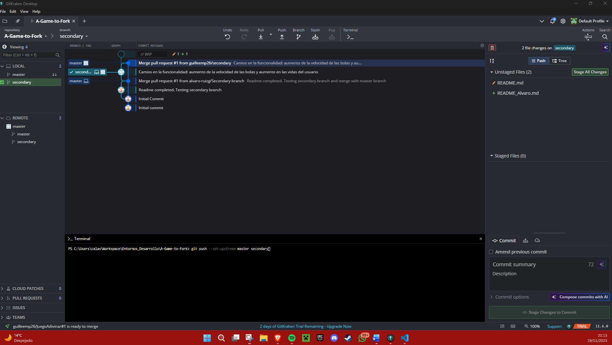

# Segundo ejercicio de Git: creación de un repositorio propio modificando un proyecto base

---

## Pasos que he realizado para completar la actividad

### 1. [Clonar reposio inicial](#clonar-repositorio-inicialClonar)
### 2. [Subir reposotorio](#clonar-repositorio-inicialClonar)
### 3. [Crear ramas](#clonar-repositorio-inicialClonar)
### 4. [Realizar cambios](#clonar-repositorio-inicialClonar)
### 5. [Subir archivos](#clonar-repositorio-inicialClonar)
### 6. [Merge pull request](#clonar-repositorio-inicialClonar)

---

### Clonar repositorio inicial
El primer paso que he hecho para esta actividad, es crear la carpeta en la que voy a alojar el proyecto y clonar tu repositorio.
Esto lo he hecho con GitKraken, nada más abrir el programa te da la opción de: "Abrir repositorio", "Clonar repositorio" o "Crear repositorio".
He seleccionado la opción "Clonar repositorio" y he seleccionado la carpeta creada anteriormente para alojar el proyecto.

### Subir repositorio base a mi repositorio propio
Luego he cambiado la URL remota por la de mi repositorio. Esto lo he hecho con el comano ``git remote remove origin`` y luego he añadido la URL de mi repositorio con el comando ``git remote add origin https://github.com/guilleemp26/Entrega2Git.git``. Una vez tengo el remote con mi URL, he subido todo el proyecto a mi repositorio con los comandos ``git add .``, ``git commit -m "Texto del commit"``, ``git push``

### Crear rama secundaria
Una vez tengo todo el proyecto en mi repositorio, he creado una rama local secundaria llamada "Secondary" y MUY importante (Aquí me equivocaba antes), también he creado una segunda rama remota llamada también "Secondary".

### Realizar los cambios necesarios
Después de crear ambas ramas, con el comando ``git checkout secondary`` he seleccionado la rama secundaria como rama de trabajo. Luego he realizado los cambios en el juego, que en mi caso han sido los siguientes: 
- Archivo(src/java/controller/GameController.java) Línea: 32, private final double FALL_SPEED = 1 --> 7
- Archivo(src/java/model/GameModel.java) Línea: 11, private static final int MAX_LIVES = 3 --> 5

### Subir los cambios
Una vez hechos los cambios, he subido a la rama secundaria los archivos con estos cambios. Para esto he usado los comandos ``git add .``, ```git commit -m "Texto del commit"`` y ``git push --set-upstream master secondary``

### Hacer la Merge Pull Request
Después de hacer el push con los cambios, me ha aparecido la opción de revisar el commit en github para hacer la merge pull request. Después de aceptarla se han subido los cambios a la rama "Main", quedando así en GitKraken
